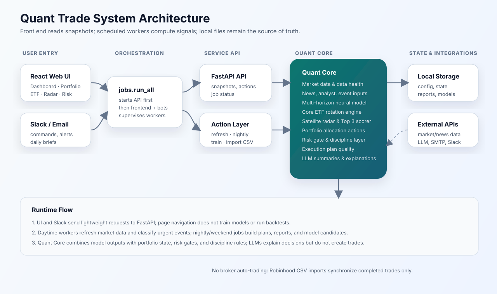

# 估值雷达

这是一个面向个人投资研究的本地系统。它不再管理真实持仓，也不预测短期价格路径，而是寻找“价格因事件明显下跌、基本面仍可验证、确定性估值提供足够安全边际”的股票或 ETF。

> 本项目用于研究和辅助判断，不构成投资建议。系统输出是待研究候选，不是自动交易指令。

## 系统架构



核心边界：

- LLM 负责选择适用的估值模型、从证据提取情景假设、研判事件并解释结果。
- 确定性 Python 引擎负责估值、概率区间、阈值校验和持久化，不允许 LLM 直接写入价格结论。
- 研究结论与个人持仓完全解耦；系统不连接券商、不读取 Robinhood、不记录现金或交易。
- React 只读取 FastAPI 快照，切换页面不会触发网络抓取或重计算。

## 研究流程

1. 从 S&P 500、Nasdaq 100、固定关注列表和 ETF 列表构建研究范围，默认不超过 700 个标的；指数成分会自动附带行业及行业 ETF 基准。
2. 并发读取本地 Parquet 历史缓存；过期时先请求 Stooq，失败后回退到 yfinance。
3. 计算相对 SPY、行业 ETF、52 周高点和近期波动的异常下跌分数。
4. 只对前 30 个错位候选及指定 ETF 做深度分析，避免为全市场逐一调用 LLM。
5. 股票财务数据优先使用 SEC Company Facts；无 SEC 覆盖时使用明确标记的 yfinance 备用数据。
6. 远程 LLM 从白名单中选择公司类型和估值模型，并提取悲观、基准、乐观假设。
7. 确定性估值引擎计算主模型与兼容辅助模型的交叉估值，再生成合理价值 P10/P50/P90、安全边际、模型离散度和可信度。
8. 基本面损伤、困境概率、事件暂时性、价格企稳和市场风险共同决定是否进入研究名单。
9. 夜间生成 JSON/Markdown 报告并推送 Slack/Email；周末同时校准历史推荐是否跑赢短期国债代理 SGOV，以及是否取得相对 SPY 的市场超额。

支持的主要估值路线包括多阶段 FCFF、成长型收入 DCF、剩余收益、标准化盈利、收入倍数、REIT FFO/NAV、分部估值、困境加权，以及 ETF 风险溢价/收益率久期/现货持有模型。

## 安装与启动

需要 Python 3.10+ 和 Node.js 18+。项目统一使用 `~/venv`，不使用项目内 `.venv`。

```bash
python3 -m venv ~/venv
source ~/venv/bin/activate
pip install -r requirements.txt
cd frontend && npm ci && cd ..
~/venv/bin/python -m jobs.run_all
```

本机访问 `http://127.0.0.1:5173`。可信局域网访问使用：

```bash
~/venv/bin/python -m jobs.run_all --host 0.0.0.0
```

终端会输出局域网地址。系统没有公网认证，不应直接暴露到互联网。

统一入口依次启动 FastAPI、React、可选 Slack Bot，并在进程内管理交易时段行情刷新、工作日夜间研究和周末校准。API 未健康前不会启动前端，因此不会再产生启动阶段的代理连接拒绝提示。

## 首次使用

1. 打开“系统管理”。
2. 在“研究范围与门槛”中填写 SEC User-Agent，建议使用包含真实联系邮箱的应用标识。
3. 在页面配置远程 LLM。支持 OpenAI、OpenRouter 及任意 OpenAI-compatible `/v1/chat/completions` 接口，并点击“测试远程LLM”。
4. 如使用 LM Studio，配置本地 SLM 地址与模型名。本地 SLM 仅润色结构化文字；研究、事件分析和估值路由仍使用远程 LLM。
5. 按需配置 Slack、Email、研究范围和阈值，然后点击“保存全部设置”。
6. 点击“运行完整估值研究”，等待任务状态显示完成。

密钥写入 `storage/config/notification_secrets.local.json`，文件权限尽量设为 `0600`，并由 `.gitignore` 排除。公开配置中只保留空密钥字段。

## Slack

推送只需要 Incoming Webhook。双向 `/quant` 命令还需要 Socket Mode 的 Bot Token 和 App Token；可直接在“系统管理”保存，随后重启 `jobs.run_all`。

可用命令：

```text
/quant 帮助
/quant 概览
/quant 机会
/quant 分析 MSFT
/quant 风险
/quant 关注列表
/quant 关注 NVDA
/quant 取消关注 NVDA
/quant 数据状态
/quant 策略校准
/quant 刷新行情
/quant 运行完整研究
```

系统不再接受买入、卖出、持仓或 CSV 上传命令。

## 文件布局

```text
quant_core/
  data/            行情、Parquet缓存、数据健康
  fundamentals/    SEC与备用财务数据
  opportunities/   异常下跌、事件研判、机会评分
  valuation/       LLM模型路由与确定性估值
  research/        全量流水线、manifest、历史校准
  risk/            市场风险环境
  llm/             OpenAI兼容调用与叙述路由
  notifications/   Slack与Email发送
  api/             快照读取和后台动作
frontend/          React WebUI
jobs/              API、统一启动、夜间和周末任务
storage/config/*.example.json  可提交的默认模板
storage/config/*.json          每台机器的本地设置，不提交Git
storage/state/valuation_radar/     运行快照，不提交Git
storage/journals/valuation_radar/  推荐历史，不提交Git
storage/cache/valuation_radar/     行情、指数与SEC缓存，不提交Git
reports/           最新研究报告，不提交Git
```

正式表格缓存使用 Parquet；配置与可审计快照使用 JSON；推荐历史使用 JSONL。不需要数据库。

WebUI 会修改的实际配置均由 `.gitignore` 排除。新电脑首次启动时读取同名 `*.example.json`，在设置页保存后生成本机 JSON 覆盖；因此不同电脑的 LLM、Slack、Email、研究范围和调度设置不会互相冲突。

## 单独运行与测试

```bash
~/venv/bin/python -m jobs.nightly_research --force --no-notify
~/venv/bin/python -m jobs.weekend_research --force --no-notify
~/venv/bin/python -m unittest discover -s tests -v
cd frontend && npm run build
```

诊断时可在“系统管理”下载安全诊断包，其中不包含密钥。

## 可靠性规则

- 每个推荐每天只保留一条最新观察，手动重跑不会夸大校准样本。
- 完整研究写入 `valuation_research_manifest.json`；失败会保留阶段与错误，行情和 SEC 缓存允许下次自然续跑。
- 市场风险越高，要求的安全边际越大。
- LLM 路由失败时只允许规则降级和观察，不会把未复核结果升级为强机会。
- 数据缺失、估值离散过大、基本面损伤或价格未企稳都会阻断行动候选。
- 周末校准只使用当时已记录的推荐，比较 63/126/252/504 个交易日后的对短期国债超额收益与相对 SPY 市场超额。
