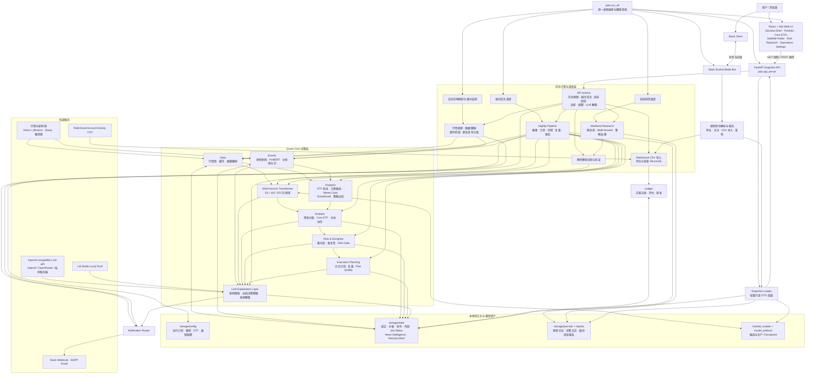

# 量化持仓追踪与策略回测系统

一个本地量化投资组合辅助决策系统，用于管理持仓、维护观察列表、刷新行情、生成量化信号、执行策略回测，并在组合层面提示行业集中度和相关性风险。V3 已切换为 `FastAPI + React` 前后端分离架构：后端按计划生成快照，前端快速读取结果，不再使用 Streamlit rerun 模式。

> 说明：本项目用于研究、学习和辅助决策，不构成投资建议。真实交易前请结合账户风险、税务、流动性和券商规则独立判断。

## 功能概览

- 持仓管理：支持添加、编辑、删除、加仓买入、部分卖出，以及“转到关注/转到持仓”等仓位迁移操作；最小交易单位为 `0.001` share，适合 Robinhood 等支持 fractional shares 的账户。
- 观察列表：维护关注股票、备注，并显示模型估算的上涨预期价区间。
- 实时行情：通过 Yahoo Finance 获取持仓和观察列表价格，并使用本地缓存减少重复请求；应用运行时会自动刷新过期价格。
- 多周期决策：对持仓、核心 ETF 和卫星候选统一输出 `63/126/252` 交易日的上涨概率、绝对收益/价格区间、跑赢短债与 SPY 的概率、短期时机和最终仓位动作。
- 分析师共识增强：夜间抓取分析师买卖共识；当看多或看空比例超过 `90%` 且样本充足时，增强关注列表提示为“强烈买入”或“强烈卖出”。
- ETF 代理意见：当 ETF 本身没有分析师评级时，系统会自动读取前十大持仓，并按权重聚合成分股分析师共识，生成 ETF 的代理买卖意见。
- 仓位建议：结合当前持仓、目标仓位和回测结果，给出加仓、减仓、退出或观望建议。
- 组合级建议：分析行业集中度和高相关股票组合，避免只看单只股票信号而忽略整体风险。
- 神经量化引擎：默认模型为跨资产多周期 Transformer，以绝对收益、上涨概率和跑赢短期美债为主要训练目标，以跑赢 SPY 和横截面排名为辅助目标；短债总回报默认使用可配置的 `BIL` 代理。
- 模型治理：周末执行 masked-patch 预训练和 purged walk-forward，检查绝对收益误差、上涨/跑赢短债概率校准、Top 3 相对短债及 SPY 的超额收益、Rank IC、分位数覆盖和 MoE 路由；任何 promotion 都必须人工确认。
- 新闻/事件系统：支持本地 `storage/state/market_events.json` 事件输入，并可通过事件源适配层自动抓取外部新闻事件。
- 事件风控急刹车：可基于 FOMC/宏观事件和 VIX 高波动阈值触发临时风险收缩（限制仓位或暂停新增仓位）。
- FinBERT 情绪分析：事件/新闻可选用 FinBERT 进行情绪打分；未安装时自动回退为关键词情绪规则。
- Monte Carlo 预期收益分布：可基于历史波动生成收益分布、VaR/CVaR 和区间预期，辅助决定仓位与止盈止损。
- 通知与夜间任务：支持 Slack / Email 强信号告警，并提供独立 `jobs.nightly_alerts` 入口用于定时调度。
- Robinhood 导入闭环：在 `Operations` 上传 Account Activity CSV 后，系统会去重导入交易记录、reconcile 当前持仓/现金，并在 `Portfolio` 页面展示持仓、关注、最近交易、导入日摘要、post-close review 和 plan-quality。
- 本地数据文件：持仓、观察列表、交易记录、价格缓存都保存在本地 JSON 文件中，无需数据库。

## 系统架构



架构边界：

- **前端不运行重型量化计算**：React 通过 FastAPI 读取已经生成的稳定快照，页面切换不会触发训练或回测。
- **交易动作由量化与风控链决定**：模型输出先经过组合引擎、纪律层和 Risk Gate，再形成次日计划；LLM 只负责总结和解释，不能创造新动作或绕过风控。
- **系统不连接券商下单**：Robinhood 只通过 Account Activity CSV 同步已经发生的交易，所有真实交易仍由用户手工执行。
- **本地文件是唯一事实来源**：配置、运行状态、日志、报告和模型资产均保存在项目目录中，不依赖数据库服务。
- **统一入口负责可靠启动**：`jobs.run_all` 先等待 FastAPI 健康检查通过，再启动 React，同时管理 Slack Bot、日间刷新、夜间任务和周末研究。

## 快速开始

### 1. 创建环境

前端使用 Vite 6，需要 `Node.js >= 18`。如果新电脑上 `npm run dev` 报 `Unexpected token '.'` 或 Vite 启动后马上退出，通常就是 Node 版本太旧。先确认：

```bash
node --version
npm --version
```

如果 Node 低于 18，请先升级 Node，再安装前端依赖。

```bash
python -m venv ~/venv
source ~/venv/bin/activate
pip install -r requirements.txt
cd frontend && npm ci && cd ..
```

#### Jetson PyTorch

Jetson 使用 NVIDIA JetPack 自带 CUDA，不能依赖 PyPI 的通用 PyTorch wheel。`requirements.txt`
会在 `aarch64` 上跳过 PyTorch，避免覆盖 NVIDIA 专用构建。请先按照
[NVIDIA Installing PyTorch for Jetson Platform](https://docs.nvidia.com/deeplearning/frameworks/install-pytorch-jetson-platform/index.html)
安装与当前 JetPack 版本匹配的 PyTorch，再安装本项目依赖。

在启动系统前可以这样确认后端环境确实看到了 GPU：

```bash
source ~/venv/bin/activate
python -c "import sys, torch; print(sys.executable); print(torch.__version__); print(torch.version.cuda); print(torch.cuda.is_available()); print(torch.cuda.get_device_name(0) if torch.cuda.is_available() else 'CUDA unavailable')"
```

如果 `torch.version.cuda` 是 `None`，当前安装的是 CPU-only PyTorch；如果它有版本号但
`torch.cuda.is_available()` 仍为 `False`，则需要检查 JetPack/CUDA 兼容性或容器的
NVIDIA runtime。不要在 Jetson 上再次运行 `pip install torch==...` 覆盖 NVIDIA wheel。

### 2. 启动应用

```bash
~/venv/bin/python -m jobs.run_all
```

默认这个命令会尽量一次性启动：

- FastAPI snapshot API: `http://127.0.0.1:8710`
- React frontend: `http://127.0.0.1:5173`

### 局域网访问

在 Jetson 或服务器上使用：

```bash
source ~/venv/bin/activate
cd ~/work_dir/quant_trade_sys
python -m jobs.run_all --lan
```

然后在服务器上查询局域网 IP：

```bash
hostname -I
```

例如 IP 为 `192.168.1.50`，同一局域网内的电脑访问：

```text
http://192.168.1.50:5173
```

LAN 模式只暴露前端端口 `5173`，前端会在服务器内部代理 `/api` 到本机 FastAPI。
系统目前没有用户认证，因此只应在可信家庭/私人局域网中启用，不要把 `5173`
端口转发到公网。
- Slack bot
- nightly scheduler
- market refresh worker

新架构下，前端只读取后端快照，不在页面切换时触发重型量化计算。需要立即补齐数据或重跑流程时，请在 React 前端的 `Operations` 页面触发 `Force Fresh Market Data`、`Run Full Nightly Pipeline` 或 `Run Weekend Research`。

### 3. 运行测试

```bash
PYTHONPYCACHEPREFIX=/tmp/pycache ~/venv/bin/python -m unittest discover -s tests -v
```

当前测试覆盖 fractional shares、数据文件同步、策略注册、组合建议、仓位建议、回测引擎适配和 RSI 参数修复等关键路径。

## 当前默认工作流

当前版本更偏向“少而硬”的交易辅助，而不是堆很多花哨模型。默认工作流如下：

1. 白天后台刷新行情并运行大盘与紧急事件监控；页面只读取快照，不在切换标签时训练模型。
2. 夜间使用已训练的多周期 Transformer 生成持仓、核心 ETF、卫星 Top 3 和次日计划；没有强信号时明确输出不交易。
3. 模型默认使用 `10y` 历史、`252` 日 lookback 和 `63/126/252` 日目标。夜间只推理，不会每天盲目重训。
4. 周末按 `retrain_interval_days` 检查是否需要重训，默认间隔 `30` 天；训练包含预训练与 walk-forward 验证。
5. `Research & Models` 页面可以手动触发完整训练，并查看候选模型、从零训练版本和相对强弱基线的对比。
6. 新训练版本先进入 shadow；只有 walk-forward 验证通过并在 `Research & Models` 手动晋升后，才可进入夜间正式交易建议。
7. 夜间报告、盘前计划、风险和强信号仍可通过 Slack 与 Email 发送。

## 周末研究模式

系统现在支持一条独立的 `Weekend Research` 链路，用来在周末跑更长时间的研究任务，帮助形成下周的市场偏向判断，而不是挤进盘中或首屏渲染里。

默认行为：

- 默认在 `Settings -> 通知 / 模型 -> 系统节奏 / 自动分析` 中启用。
- 默认调度为 `Saturday 10:00` 本地时间。
- 神经模型默认使用 `10y` 历史；其他周末风险研究仍可使用独立配置窗口。
- 默认会生成：
  - 核心 ETF 轮动研究
  - 更大容量的卫星候选池扫描
  - 多周期神经模型重训检查、预训练和 walk-forward 验证
  - `next_week_bias`（如下周偏防守 / 平衡 / 风险偏好）

结果位置：

- 运行时快照：
  - `storage/state/weekend_research_snapshot.json`
- 最新报告：
  - `reports/weekend_research_latest.md`
  - `reports/weekend_research_latest.json`
- 页面入口：
  - `Operations -> 报告与通知 -> 周末研究`
  - `Settings -> 快速操作 -> 立即运行周末研究`

如果你想手动强制跑一次：

```bash
~/venv/bin/python -m jobs.weekend_research --force
```

如果你平时就是用统一入口：

```bash
~/venv/bin/python -m jobs.run_all
```

那么 `run_all` 会在周末按配置自动检查并执行周末研究任务。

## 开机自动运行

推荐仍然用统一入口：

```bash
~/venv/bin/python -m jobs.run_all
```

项目提供了两个自启模板：

- macOS: `deploy/launchd/com.quant-trade-system.plist.example`
- Linux / Jetson: `deploy/systemd/quant-trade-system.service.example`

### macOS: launchd

1. 复制模板：

```bash
mkdir -p ~/Library/LaunchAgents
cp deploy/launchd/com.quant-trade-system.plist.example ~/Library/LaunchAgents/com.quant-trade-system.plist
```

2. 编辑 `~/Library/LaunchAgents/com.quant-trade-system.plist`，把 `YOUR_USER` 和项目路径改成你自己的路径。

3. 确保日志目录存在：

```bash
mkdir -p storage/logs
```

4. 加载并启动：

```bash
launchctl unload ~/Library/LaunchAgents/com.quant-trade-system.plist 2>/dev/null || true
launchctl load ~/Library/LaunchAgents/com.quant-trade-system.plist
launchctl start com.quant-trade-system
```

5. 查看日志：

```bash
tail -f storage/logs/launchd.out.log storage/logs/launchd.err.log
```

### Linux / Jetson: systemd user service

1. 复制模板：

```bash
mkdir -p ~/.config/systemd/user
cp deploy/systemd/quant-trade-system.service.example ~/.config/systemd/user/quant-trade-system.service
```

2. 编辑 `~/.config/systemd/user/quant-trade-system.service`，把 `YOUR_USER` 和项目路径改成你自己的路径。

3. 启用并启动：

```bash
systemctl --user daemon-reload
systemctl --user enable --now quant-trade-system.service
```

4. 如果希望用户未登录时也能启动：

```bash
sudo loginctl enable-linger "$USER"
```

5. 查看状态和日志：

```bash
systemctl --user status quant-trade-system.service
journalctl --user -u quant-trade-system.service -f
```

## 手工维护持仓与观察列表

除了通过 UI 添加和编辑，也可以直接维护 `storage/state/portfolio_input.json`。系统会在启动或页面重跑时检测这个文件：当它比运行时文件 `storage/state/portfolio_data.json` 更新时，会自动导入。侧边栏也提供“从文件重新加载持仓/关注”按钮，可以强制同步。

`storage/state/portfolio_input.json` 是个人数据文件，已经加入 `.gitignore`。仓库中提供了 [storage/config/portfolio_input.example.json](storage/config/portfolio_input.example.json) 作为格式参考。

```json
{
  "holdings": [
    {
      "symbol": "AAPL",
      "shares": 0.125,
      "cost": 180.5,
      "sector": "Technology"
    },
    {
      "symbol": "IAU",
      "shares": 1.0,
      "cost": 90.4,
      "sector": "Gold"
    }
  ],
  "watchlist": [
    {
      "symbol": "MSFT",
      "notes": "Wait for pullback"
    }
  ]
}
```

同步规则：

- `symbol` 会自动转成大写。
- `shares` 必须大于等于 `0.001`。
- `cost` 是持仓成本价，`sector` 用于组合行业集中度分析。
- `current_price` 和 `last_price` 可以省略；系统会按股票代码尽量保留已有运行时价格。
- 如果文件中只写 `holdings` 或只写 `watchlist`，未写的部分会保留当前运行时数据。
- 如果需要清空某一部分，请显式写成空数组，例如 `"watchlist": []`。

## 数据文件说明

- `storage/state/portfolio_input.json`：手工维护入口，适合批量修改持仓和观察列表，不提交到 Git。
- `storage/state/portfolio_data.json`：应用运行时数据，保存当前持仓、观察列表、最新价格和更新时间。
- `storage/state/price_cache.json`：行情缓存文件，减少短时间内重复请求。
- `storage/state/analyst_consensus_cache.json`：夜间生成的分析师共识缓存文件，用于增强关注列表买入提示，也会保存 ETF 的持仓加权代理意见。
- `storage/state/alert_state.json`：告警去重状态文件，记录已发送过的强信号和风险告警。
- `storage/config/notification_config.json`：本地通知、LLM 和发送策略的非敏感配置，不提交到 Git。
- `storage/config/notification_secrets.local.json`：只保存 Slack webhook、SMTP 密码及 LLM API key；不提交到 Git，并尽量使用仅当前用户可读写的文件权限。
- `storage/state/market_events.json`：手工维护事件输入文件（可选）。
- `storage/state/event_source_status.json`：最近一次财经新闻抓取的源级成功/失败状态。
- `storage/state/news_intelligence.json`：夜间生成的组合相关新闻、分析师共识与 LLM 解读快照。
- `config/event_sources.json`：事件源配置，定义本地 mock 与自动抓取源（如 yfinance 新闻）。
- `storage/state/transactions.json`：买入/卖出交易记录与组合动作事件记录（如转到关注、转到持仓等）。
- `storage/state/multi_horizon_snapshot.json`：前端、夜间计划和通知共同读取的统一多周期模型快照。
- `storage/state/multi_horizon_validation.json`：walk-forward 绝对收益误差、上涨/跑赢短债概率校准、Top 3 对短债及 SPY 超额收益、分位数覆盖和 MoE 路由验证结果。
- `storage/journals/multi_horizon_predictions.jsonl`：紧凑预测日志，用于未来 63/126/252 日实际结果归因。
- `storage/config/multi_horizon_model.json`：模型结构、训练周期、候选池上限和 artifact 路径配置。
- `model_artifacts/bootstrap/`：随代码发布的 `SHADOW` 冷启动 checkpoint 与 SHA-256 manifest；新电脑首次推理时会自动安装到本地 `trained_models/`。

## 策略与回测

旧的均线、布林带、MACD 和 RSI 只保留为离线研究对照，`config/strategies.json` 默认全部关闭。生产决策不再从这些单票策略中选择一个“默认策略”。

- 双均线交叉：`MA(20)` 和 `MA(50)` 金叉买入、死叉卖出。
- 布林带反转：价格接近下轨时关注反弹，回到中轨附近考虑止盈。
- MACD 金叉死叉：动能转强买入，动能转弱卖出。
- RSI 超买超卖：低位回升买入，高位回落卖出。

说明：

- `finance_multi_asset_transformer` 是当前默认决策模型。
- bootstrap checkpoint 只提供冷启动推理和影子观察，不代表模型已通过生产晋升。
- Research & Models 页面在训练期间每秒刷新任务状态，显示 CPU/CUDA/MPS 设备、epoch、loss、耗时、样本规模和最近训练日志。
- 传统规则策略仍保留，主要用于做对照、解释和回测基线。
- LightGBM、CatBoost、XGBoost 及其生产依赖已经删除；除非未来消融实验证明有稳定的增量经济价值，否则不会重新加入生产。
- 长周期训练默认排除杠杆、反向与波动率战术产品；它们继续由盘中战术模块处理，不和普通股票、核心 ETF 共用长期 Top 3 排名。

离线基准只在周末研究任务中运行，用来回答“复杂模型是否真的优于简单规则”。它们不会生成日常生产信号，也不会阻塞多周期模型的训练、推理或页面读取。

## 深度学习策略

当前主模型位于 `quant_core/models/multi_horizon/`。它以整个候选 universe 为一个跨资产学习问题，而不是为每只股票单独训练一个短线分类器。

默认设备参数为：

```json
{
  "device": "auto"
}
```

自动选择顺序：

- 有 NVIDIA GPU 时使用 `cuda`。
- 在 Apple Silicon Mac 且 PyTorch 支持 MPS 时使用 `mps`。
- 其他环境自动回落到 `cpu`。

当前默认训练参数：

- 历史窗口：`10y`
- 预测目标：`63/126/252` 交易日
- lookback：`252` 交易日
- 监督训练轮数：`30`
- masked-patch 预训练最多：`20` 轮
- 预训练验证：按时间顺序保留尾部 `15%`，最少训练 `5` 轮，验证损失连续 `4` 轮无有效改善则提前停止
- 设备：`auto`
- 夜间模式：只推理
- 周末模式：到期后重训并验证

模型采用候选与生产双 checkpoint：

- `trained_models/finance_multi_asset_transformer.pt`：最新训练候选模型。
- `trained_models/finance_multi_asset_transformer_production.pt`：当前生产建议模型。
- 训练和周末重训只更新候选模型，不会自动覆盖生产模型。
- Walk-forward 验证通过后，可在 Research & Models 页面人工 Promote。
- 尚无生产模型时，也可以使用带明确警告的首次人工部署；治理记录会标记
  `INITIAL_MANUAL_OVERRIDE`，后续仍应由验证通过的新候选模型替换。
- 自动 promotion 始终关闭。

Settings 页面中的 Remote LLM 和 Local SLM 状态在保存后只表示 `CONFIGURED`。
点击对应的测试按钮并完成真实请求后，才会显示 `TESTED OK`；调用错误会直接显示
`TEST FAILED` 和服务返回的错误原因。

Research & Models 页面提供 `Download training analysis`。它会生成一个 ZIP，包含：

- 训练特征与标签面板 `multi_horizon_panel.parquet`
- walk-forward 验证、模型快照、治理状态和训练任务日志
- 候选、预训练及存在时的生产模型 checkpoint
- Python、PyTorch、CUDA 与 GPU 环境信息
- 文件大小、SHA-256 和缺失文件清单

该分析包不会包含持仓、交易流水、通知配置或任何 API key/密码。

如果当前环境没有安装 PyTorch，系统不会崩溃，深度学习策略会返回 `HOLD` 并提示依赖缺失。
macOS 和普通 x86 Linux 的安装方式：

```bash
pip install "torch>=2.2.0"
```

Jetson 请使用前文所述的 NVIDIA JetPack 对应构建，不要使用这条通用安装命令。

如需启用 FinBERT（自动新闻情绪）：

```bash
pip install "transformers>=4.40.0"
```

## 本地 SLM 接入方案

当前推荐用 `LM Studio` 作为本地 SLM server，而不是让项目自己托管模型服务。

默认预设模型：

- `Qwen/Qwen3-0.6B`

默认用途：

- 只负责把结构化原因引擎的输出转述得更自然
- 不负责复杂解释、调研或综合分析

默认服务地址：

- `http://127.0.0.1:8000/v1`

### 在 LM Studio 中启动

1. 在 LM Studio 下载并加载 `Qwen/Qwen3-0.6B`
2. 打开 `Developer` / `Local Server`
3. 启动 OpenAI-compatible server
4. 记下 server 地址，默认可用 `http://127.0.0.1:8000/v1`

### 在系统里怎么接入

1. 打开 `Settings`
2. 点击 `写入本地 SLM 默认配置 (LM Studio / Qwen3-0.6B)`
3. 保持默认：
   - `Local Base URL = http://127.0.0.1:8000/v1`
   - `Local Model = Qwen/Qwen3-0.6B`
4. 在 `Settings` 里点击 `测试本地 SLM`

如果以后切换本地小模型，通常只需要：

- 在 LM Studio 里换模型
- 在 `Settings` 中调整 `Local Model`
- 如果端口或地址不同，再改 `Local Base URL`

### 本地 SLM 不可用时的远程 LLM fallback

系统的默认路由规则是：

- 结构化原因转述：优先 `local_slm`，失败后自动尝试远程 `llm`。
- 复杂解释 / 调研 / 综合分析：优先远程 `llm`，必要时才尝试 `local_slm`。

这意味着如果 LM Studio 没有启动、端口不对或模型未加载，只要远程 LLM 已在 `Settings` 或环境变量中配置好，系统会自动兜底调用远程 OpenAI-compatible API。

常用环境变量：

```bash
export LLM_ENABLED=true
export LLM_PROVIDER=openai
export LLM_API_BASE_URL=https://api.openai.com/v1
export LLM_API_KEY=你的_api_key
export LLM_MODEL=gpt-5-mini
```

如果使用 OpenRouter：

```bash
export LLM_ENABLED=true
export LLM_PROVIDER=openrouter
export LLM_API_BASE_URL=https://openrouter.ai/api/v1
export LLM_API_KEY=你的_openrouter_key
export LLM_MODEL=openrouter/free
```

也可以填写某个具体免费模型的完整 slug，但必须包含 OpenRouter 页面显示的组织前缀和
`:free` 后缀。Settings 测试失败时会显示 OpenRouter 返回的具体错误正文，而不再只显示
笼统的 `HTTP 400`。

LLM / SLM 只负责转述、解释和整理结构化证据，不会直接生成交易动作。

### 财经新闻与分析师信息

- 日间市场刷新和夜间流水线都会按 `config/event_sources.json` 抓取新闻；失败时保留上一份缓存，不让单一新闻源阻断量化主流程。
- 夜间任务会将活跃事件、当前持仓、卫星候选和分析师共识组合成 `news_intelligence.json`。
- 远程 LLM 优先负责组合新闻综合解读；没有可用 LLM 时仍会生成可审计的结构化摘要。
- Dashboard 展示最相关的标的、方向、置信度、风险动作和原始标题证据；夜间 Slack/Email 报告也包含同一份摘要。
- Core ETF、Satellite Radar 和 Risk 页面提供按需解释按钮，只有点击时才调用远程 LLM。
- 当前分析师模块读取的是推荐数量与强弱共识，不包含付费研报正文。系统会明确标记这一限制，不会伪装成已经阅读过完整研报。
- 新闻源开关、最近抓取状态和分析师缓存状态集中显示在 Settings 页面。

### LLM 全局交易摘要

- 夜间流水线会把账户资金、全部多周期模型信号、核心 ETF、卫星候选、纪律与风险、次日计划、Change Feed、新闻、分析师共识和数据健康统一交给远程 LLM 整理。
- Dashboard 首页顶部展示同一份全局摘要，并提供手动刷新按钮。
- 摘要必须明确区分“有动作”和“无强信号，保持不动”，同时列出信号冲突、可信度问题和失效条件。
- 系统用不含时间戳的实质信号签名去重。普通价格抖动不会重复调用；新的高优先级变化或盘中紧急事件才会触发刷新。
- 重大异动后的摘要会附加到现有 Slack/Email 盘中通知；夜间摘要随完整夜间报告发送。
- Settings 可以分别控制摘要功能、异动自动刷新和 Slack/Email 附加发送。
- LLM 只是统一解释层，不能创造量化系统没有给出的动作，也不能覆盖风险闸门。
- `Context window tokens` 与 `Max output tokens` 是不同概念：前者可按当前模型设置为 `200000`，全局决策摘要默认拥有独立的 `16000` token 输出预算。
- 免费路由若长时间持续推理，会在独立墙钟超时后自动退回结构化摘要，避免阻塞夜间任务和通知。

## 组合级建议

组合建议不只看单个股票信号，还会结合整体风险：

- 行业集中度：如果某个 `sector` 的市值占比过高，会提示可能需要降低集中度或增加其他板块暴露。
- 相关性拥挤：如果两个持仓历史收益相关性过高，且合计仓位较大，会提示避免同时继续加仓。
- 缺失价格：如果持仓没有现价，组合建议会提示这些标的暂未纳入组合级计算。

为了让行业集中度分析更准确，建议在 `storage/state/portfolio_input.json` 或 UI 编辑持仓时维护 `sector`。

## 通知配置

应用内提供“通知配置”页，可配置并测试。当前通知能力：

- 已支持：Slack 单向告警（Incoming Webhook）、Email 单向告警（SMTP）。
- 已支持：Slack -> 系统 的双向控制（`/quant` + Socket Mode bot），用于从 Slack 查询驾驶舱状态、更新本地持仓/关注列表，并支持上传 Robinhood CSV 直接同步交易记录。

注意：

- 当前系统不会连接券商，也不会自动实盘下单。
- Slack / Email 发送通知；Slack 双向命令只会更新本地 JSON 持仓状态，不会触发真实交易。

### 当前已支持：Slack 单向告警

- Slack Incoming Webhook：适合实时告警，系统通过 webhook URL 发送消息到指定频道。
- Email / SMTP：适合每日摘要或留档；可以用一个 Outlook 账号作为发件人，把消息发到 Gmail。
- 告警去重：`storage/state/alert_state.json` 会记录已发送告警，避免同一个强烈买入/卖出每天重复发送；风险告警默认 6 小时冷却。

Slack 单向告警推荐配置步骤：

1. 在 Slack API 后台创建一个 Slack App。
2. 打开 `Incoming Webhooks`。
3. 为目标频道生成一个 webhook URL。
4. 在系统的“通知配置”页填入这个 webhook URL，或者在运行环境中设置 `SLACK_WEBHOOK_URL`。
5. 点击系统中的 Slack 测试发送按钮，确认频道能收到消息。

如果你的系统跑在服务器上，而你平时在本地电脑使用 Slack：

- 服务器上需要保存 `SLACK_WEBHOOK_URL`，由服务器负责发送消息。
- 你本地电脑不需要额外安装任何代码，只需要登录同一个 Slack workspace，并能看到目标频道即可。
- 如果目标是私有频道，需要先把 Slack App 对应的 bot / webhook 安装到该频道。

示例环境变量：

```bash
export SLACK_WEBHOOK_URL="https://hooks.slack.com/services/..."
```

### 当前已支持：Email 单向告警

Outlook 常用 SMTP 参数：

- SMTP Host: `smtp-mail.outlook.com`
- SMTP Port: `587`
- STARTTLS: enabled
- Username: 完整 Outlook 邮箱地址
- Password: Outlook 账号密码或 app password（取决于账号安全设置）

如果 Outlook 拒绝 SMTP 登录，请先确认该账号是否允许 SMTP AUTH；若账号强制 Modern Auth/OAuth2，当前简单 SMTP 配置可能无法通过，这时更推荐使用 SendGrid、Mailgun、Resend 等邮件 API。

Email 推荐配置步骤：

1. 确定发件邮箱服务商，例如 Outlook。
2. 在“通知配置”页填写 SMTP Host、Port、用户名、密码、发件人邮箱、收件人邮箱。
3. 如果使用 Outlook，通常启用 `STARTTLS`，端口用 `587`。
4. 点击系统中的 Email 测试发送按钮。
5. 如果计划长期部署，建议把密码放到服务器环境变量中，而不是直接写入本地 JSON。

如果你的系统跑在服务器上，而你本地电脑只是收邮件：

- SMTP 配置和密码只放在服务器上。
- 你本地电脑不需要额外配置代码，只需要能登录你的 Gmail / Outlook 收件箱即可。

示例环境变量：

```bash
export SMTP_HOST="smtp-mail.outlook.com"
export SMTP_PORT="587"
export SMTP_USER="your_account@outlook.com"
export SMTP_PASSWORD="your_password_or_app_password"
export SMTP_FROM="your_account@outlook.com"
export ALERT_EMAIL_TO="your_gmail@gmail.com"
```

独立夜间告警入口：

```bash
~/venv/bin/python -m jobs.nightly_alerts --force
```

查看将生成哪些告警但不发送：

```bash
~/venv/bin/python -m jobs.nightly_alerts --dry-run --force
```

说明：

- 个股优先使用直接分析师共识。
- ETF 若缺少直接分析师数据，会自动回退到“前十大持仓加权代理共识”。
- 当前默认要求代理覆盖权重至少约 `50%`，且加权后的看多/看空比例超过 `90%`，才会触发强烈信号。
- 默认只对“强一致”分析师结论发出强化提示或通知，避免弱信号引入额外噪声。

也可以不写真实密钥到配置文件，改用环境变量：

```bash
export SLACK_WEBHOOK_URL="https://hooks.slack.com/services/..."
export SMTP_HOST="smtp-mail.outlook.com"
export SMTP_PORT="587"
export SMTP_USER="your_account@outlook.com"
export SMTP_PASSWORD="your_password_or_app_password"
export ALERT_EMAIL_TO="your_gmail@gmail.com"
~/venv/bin/python -m jobs.nightly_alerts --force
```

### Slack 双向消息控制

Slack 的双向控制已经按 `slack_bolt + Socket Mode` 的方式接上了。现在 bot 不只是处理 `/quant` slash command，也支持接收你上传的 Robinhood `Account activity CSV`，并自动完成：

- 导入交易记录
- 去重
- reconcile 当前持仓和可用现金
- 在 Slack 中返回同步摘要

`/quant` 和文件上传都需要一个常驻 bot 进程在服务器上运行，去接收 Slack 事件并调用本系统内部的命令执行层。最省事的方式是直接运行统一入口：

```bash
export SLACK_BOT_TOKEN="xoxb-..."
export SLACK_APP_TOKEN="xapp-..."
~/venv/bin/python -m jobs.run_all
```

如果你不想同时启动页面，可以加 `--no-ui`。如果只想单独起 bot，也可以运行：

```bash
~/venv/bin/python -m integrations.slack.bot
```

最重要的一点是：**token 不要写进代码里**。请把它们放在运行 bot 的那台服务器环境变量里。

如果你在 Slack 里输入 `/quant` 看到 “the app did not respond”，通常表示：

- bot 进程没有启动；
- `SLACK_BOT_TOKEN` 或 `SLACK_APP_TOKEN` 没配对；
- Slack App 还没有重新安装到 workspace；
- slash command 还没有加上 `commands` scope；
- `Socket Mode` 还没有打开，或者 app-level token 没配好。

建议的 Slack App 配置：

1. 在 Slack API 后台创建一个新的 Slack App。
2. 打开 `Socket Mode`。
3. 创建 `App-Level Token`，拿到 `xapp-...`，并授予 `connections:write`。
4. 在 `OAuth & Permissions` 里给 bot 加最小可用 scopes：
   - `commands`：让 `/quant` 可以工作
   - `chat:write`：让 bot 能回复 slash command 和文件同步结果
   - `files:read`：让 bot 可以读取你上传的 Robinhood CSV
5. 在 `Event Subscriptions` 中启用事件，并按你的使用场景订阅消息事件：
   - 如果你准备把 CSV 发给 bot 私聊：至少订阅 `message.im`
   - 如果你准备发到公开频道：订阅 `message.channels`
   - 如果你准备发到私有频道：订阅 `message.groups`
6. 把 App 安装到你的 workspace，拿到 `Bot Token`，形如 `xoxb-...`。
7. 在服务器上导出 `SLACK_BOT_TOKEN` 和 `SLACK_APP_TOKEN`，再启动 `python -m integrations.slack.bot`，或直接用 `python -m jobs.run_all` 统一启动。

这一模式下，配置位置分工如下：

- 服务器：保存 Slack token，并运行 bot。
- 本地电脑：只作为 Slack 客户端使用，不需要额外保存 bot token。

当前第一版双向控制保持确定性，已经支持：

- `可用命令`
- `系统概览`
- `今日计划`
- `风险状态`
- `核心ETF`
- `卫星雷达`
- `当前持仓`
- `当前关注`
- `状态 AAPL`
- `买入 AAPL 0.5`
- `卖出 AAPL 0.25`
- `全部卖出 TSLA`
- `转到关注 NVDA`
- `转到持仓 MSFT 1`
- `刷新 全部`

### Slack 上传 Robinhood CSV 自动同步

如果你只是想把 Robinhood 里的真实交易同步回系统，现在最省事的方式是：

1. 在 Robinhood 导出 `Account activity CSV`
2. 把这个 `.csv` 文件直接发到：
   - bot 的私聊窗口；或
   - 一个已经把 bot 拉进去的频道
3. bot 会自动完成：
   - 读取 CSV
   - 导入交易记录
   - 去重
   - 重建当前持仓和可用现金
4. 同步完成后，Slack 会回复一条摘要，通常包含：
   - 文件名
   - 解析记录数
   - 新增记录数
   - 重复跳过数
   - 不支持行跳过数
   - 当前持仓数量
   - 当前关注数量
   - 当前可用现金
   - 若检测到历史可能不完整，也会附带 warning

说明：

- 这里同步的是**已经发生的历史交易记录**，不是实盘下单。
- CSV 上传同步本身**不依赖实时价格**；它的核心作用是把系统的本地台账、当前持仓和现金，跟 Robinhood 的真实历史交易对齐。
- 如果你之后还想刷新当前市值、盈亏和页面里的最新价格，再单独执行一次 `刷新 全部` 即可。
- 同一个 CSV 重复上传不会重复导入；不同时间段但有重叠记录的 CSV，也会按 `import_key` 自动去重。

第一版仍然不建议直接做自由聊天式 agent，而是先让 Slack 稳定地调用这些确定性命令，等执行链路稳定后再接 LLM 做解释层。

### 未来可选：用小模型处理自然语言输入

未来可以接入小模型（SLM）来把自然语言解析成结构化命令，但建议它作为“解析辅助层”，而不是直接控制执行逻辑。

推荐方式：

- 第一层：规则 / 正则解析器，处理最常见、最明确的命令。
- 第二层：小模型把自然语言归一化成结构化 JSON，例如 `{"action":"BUY","symbol":"AAPL","shares":0.5}`。
- 第三层：系统只执行通过校验的结构化动作。

这样做的好处是：

- 既能支持更自然的输入表达；
- 又不会把核心执行逻辑完全交给模型“自由发挥”。

本地 SLM 当前只负责把结构化原因转述得更自然，不负责研究、预测或自由决定交易动作；复杂解释和调研交给远程 LLM。

## 项目取舍

这个系统的首要目标是辅助真实交易并提高风险调整后收益，而不是堆叠看起来先进但无法稳定赚钱的功能。因此当前版本遵循以下取舍：

- 优先做能改善胜率、盈亏比、回撤控制和执行纪律的功能。
- 新功能如果不能明显改善交易决策质量，宁可不做。
- 模型数量不是优势；稳定的数据流程、风险约束和可验证的回测更重要。
- 对新闻、情绪和分析师信息采取“少量高置信度接入”的原则，而不是无差别喂给模型。
- 仓位控制不应是僵硬的固定规则，也不应是无法解释的大黑盒；更适合走“风险状态 + 模型强度 + 组合约束”的混合资金分配引擎。

## 目录结构

```text
.
├── frontend/                              # React/Vite 前端
├── quant_core/                            # 核心业务（数据/风控/组合/通知/快照）
├── integrations/                          # 外部集成（Slack Socket Mode bot / command service）
├── strategies/                            # 周末离线规则基准
├── engine/                                # 周末离线 Backtrader 适配器
├── jobs/                                  # api_server / run_all / nightly_alerts / weekend_research
├── config/strategies.json                 # 策略配置
├── storage/config/*.example.json          # 示例配置
├── storage/state/*.json                   # 本地运行态数据（不提交）
└── tests/                                 # 单元测试
```

## 开发约定

- 优先使用 TDD：先补测试，再修改实现。
- 新增功能后运行完整测试：`python -m unittest discover -s tests -v`。
- 不要把个人运行数据提交到 Git，例如 `storage/state/portfolio_input.json`、`storage/state/portfolio_data.json`、`storage/state/price_cache.json`、`storage/state/transactions.json`。
- 新增策略优先走 `config/strategies.json`，只有通用接口无法表达时再修改注册逻辑。
